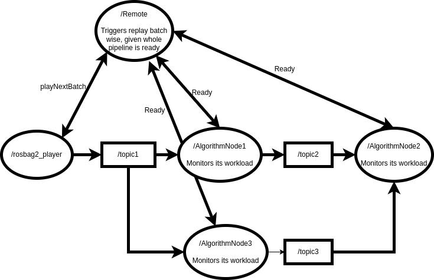

# ROS2 Controlled Replay

A simple way to control replaying during development in ROS2.

See also documentation [here](https://code.phild.eu/posts/ros2-controlled-replay/#the-approach-a-controlled-replay)
